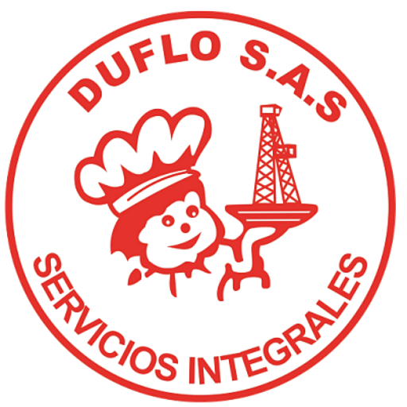

<!DOCTYPE html>
<html lang="es">
<head>
<meta charset="UTF-8">
<title>Menos Desperdicio, Más Futuro</title>
<meta name="viewport" content="width=device-width, initial-scale=1.0">

<link href="https://fonts.googleapis.com/css2?family=Montserrat:wght@600;700;800&display=swap" rel="stylesheet">

</head>

<body>

    

        
        
    

    
MENOS DESPERDICIO, MÁS FUTURO

    

        Concientización sobre el impacto ambiental del desperdicio de alimentos
    

    <h2>Impacto del Desperdicio de Alimentos</h2>

    <label for="peso">Peso del alimento desechado (kg)</label>
    <input type="number" id="peso" step="0.01" placeholder="Ejemplo: 1.50">

    <button onclick="calcularImpacto()">Calcular impacto</button>

    

        
💧 <strong>Agua utilizada:</strong>  litros

        
⚡ <strong>Energía utilizada:</strong>  kWh

        
🌫️ <strong>Emisiones de CO₂:</strong>  kg

        

            Cada residuo cuenta. Reducir el desperdicio protege el agua, la energía y el clima.
        

    

</body>
</html>
